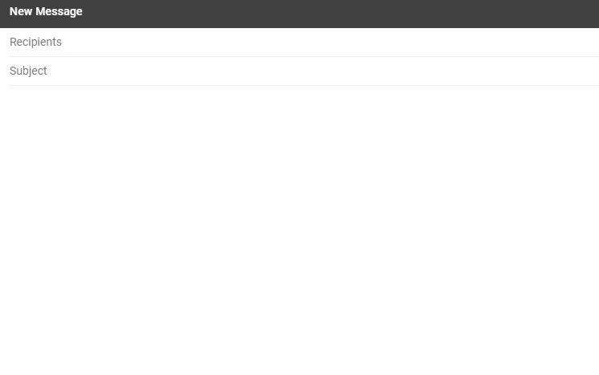
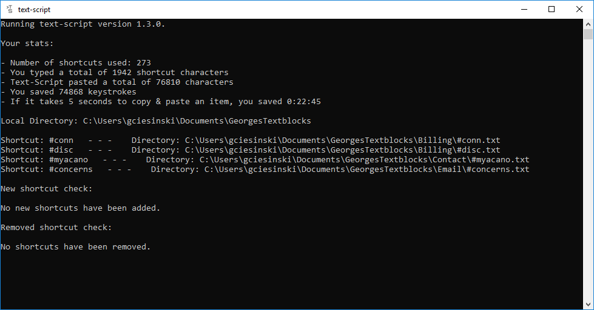

# >text-script

An app that allows users to save shortcuts and textblocks. Typing a shortcut automatically replaces said shortcut with the content of the saved textblock. This app runs in the background and improves typing efficiency.

## Motivation
I came up with this idea when I discovered there were few quality open source applications to fulfill this function. As a tech support agent, I find myself repeatedly copying the same blocks of text, such as signatures, instructions, and templates, and pasting them into emails. This is a common task in any tech support role, so I wanted to write an app to help my colleagues, and anybody else working in a similar role. 

## Built With
- Pynput
- Pyperclip

## Prerequisites
- Python 3.7
- Dependencies from requirements.txt

## Python version notice
Please be advised that I have decided to roll back to Python 3.7 as Pyinstaller, which we use to create executables, is not compatible with 3.8 yet. Once Pyinstaller supports 3.8, we will consider moving Text-Script back to this version as well. Sorry in advance if this causes any issues on your forks.

## Screenshots

### The main console window
At this stage in the project, text-script runs out of a console window. This outputs your stats, the loaded directories and shortcuts, and any shortcuts that
were added or removed since the program was last ran. A GUI planned for a future release will replace this console window in the future.

## Features

### Save Shortcuts & Textblocks
text-script lets you create shortcuts which are used to quickly and easily recall textblocks later. I have outlined the process to create new textblocks in the "Using Text-Script" section of the README file.

### Works on Windows, Linux, and OSX
Support has been added for Linux and OSX as of version 1.3.2. Please make sure you download the correct binary for your system.

### Supports Local and Remote Shortcuts
text-script allows both local and remote shortcuts to be used. Remote shortcuts can be created by a manager or supervisor and can be shared with the whole team on the network drive. While using these remote shortcuts, you can also create your own local shortcuts that only you can see and use.

### Built-in Commands
text-script has several commands built in to streamline usage. I recommend using them in a text input field as some of these paste the result of the command and require a text input field to do so. Please also note that I have moved commands to their own delimiter (!) to separate them from regular shortcuts. 

**!help** - Typing this command followed by space, tab, or enter pastes the help text, which shows how to use the program. As it pastes text, some kind of textfield is required.

**!reload** - Typing this command after adding new textblocks loads them into text-script without having to restart the app.

### Saves your statistics
As you use shortcuts, text-script saves the number of shortcuts you use, and the keystrokes you save. Each time the program starts, you are
presented with an estimated amount of time you saved by using text-script.

### Runs in the background
This application runs in the background and does not need to be maximized or in focus. Simply starting the app and minimizing it is enough for it to recognize your shortcuts. 

### Textblock directory can contain many subdirectory levels
It is possible to make folders within the textblock directory to better organize your textblocks. Even these folders can contain more folders so that a complex organizational system is possible. 

### Privacy
text-script is being designed with privacy in mind. As I intend for this application to be used free of charge by any individual or corporation, it is important to me that this application does not collect any private data. The contents of the textblocks are stored locally or within the user's network, and text-script does not duplicate or send this information anywhere. The local logs only contain characters entered after the shortcut or command delimiter until the word is complete (space, tab, or enter are pressed), and the logs are stored locally and can only be sent to me manually. 

Throughout the development of text-script, I will always keep privacy in mind and will continue to strengthen the capability of text-script to remain anonymous and private. If you have any concerns or find any privacy risks, please feel free to open an issue so that I can address this concern.

### Logs
text-script contains anonymous logging capabilities which generate up to six log files. A new log file is created whenever text-script is started, or whenever the current log file becomes too large. These logs may help to resolve any bugs that you experience while using text-script. 

Special care has been taken to keep the logs anonymous and free from private information. The log files contain only program flow debugging messages, and only track characters that text-script believes are part of a shortcut. Specifically, whenever the shortcut (# key) or command (!) delimiter is pressed, text-script logs the keys entered until space, tab, or enter is pressed, which indicates the shortcut is complete. Outside of the shortcut, no other keys are entered into the logs, and neither are the contents of your textblocks. Despite limiting the effectiveness of the logs, this program is being written primarily with privacy in mind.

The logs are manually created and have to be manually provided when bugs are encountered. You can find these logs in the Logs/ folder within the text-script directory.

## Planned future updates
- GUI to configure app and add new textblocks.
- Save whatever the latest clipboard item is and replace it after shortcut is used. Currently the last textblock used fills the last clipboard spot.
- Optional usage tracking to advise the user which textblocks see the most use and which do not.

## Installing

At this time, the program is still in early development, so I recommend always downloading the latest version as it will usually contain fixes for large bugs or issues. 

### Executable installation steps

1. Go to the [releases section](https://github.com/GeorgeCiesinski/text-script/releases) of this repository.
2. Download the top file in the latest release.
3. Extract the text-script folder within this zip file. The whole folder is needed for the installation.
4. Open the Config folder, and the config.ini file within this. You can edit the DIRECTORIES section as per the "Configuration" part of this README (below).
5. Create your shortcuts and textblocks in one of these directories as per the "Using Text-Script" section of this README (below).
6. Click text-script.exe to run the program. You may need to click yes to allow the program to run.

### Executable upgrade steps
1. Follow steps 1-3 of Executable installation steps.
2. Simply drag the text-script.exe file into your previous installation location, and click yes to overwrite the old file.
3. Run the program. This should automatically upgrade the files and preserve your textblocks and stats.

### Source Code

1. Download or clone the repository.
2. Install the dependencies from requirements.txt (virtual environment is recommended).
3. Navigate to the textscript directory and ensure your CWD and sources root is textscript.
4. Run the text-script.py file.
5. Follow steps 4 & 5 from the" Executable Installation" Steps to configure text-script and setup your textblocks.

### Configuration

Text-Script must be configured with your textblock directories. The configuration for this app is stored in the textscript/config/ directory. 
As this program has to be manually configured until the GUI is complete, please take care to only modify options in the DIRECTORIES section. 
The other sections are managed by the program. 

The DIRECTORIES section contains options which refer to a default directory (textscript/textblocks/) which can be disabled by erasing the directory listed
there, or replacing it with None. There are also options to set the local directory and the remote directory. The local directory is any folder 
on your computer containing textblocks, and the remote directory is for any folder located on a network drive. Having all three is optional, and only one is
necessary to store and load textblocks.

## Using Text-Script

### Manually creating textblocks

At this time, Text-Script does not have a GUI and textblocks must be created manually. 

I recommend either using notepad to create the textblock. Any text editor that lets you select encoding will also work.

1. Navigate to the textblock directory you set in the Config file. Using subdirectories in this location is supported, shouldn't cause any issues, and is a helpful way to organize the textblocks.
2. Create a new text file in this location. The naming convention for the text file is #________.txt where the blank is the shortcut
you will type to recall the textblock. 
3. Open the file. Paste the actual text you want to replace the shortcut with into this file. 
4. If you are currently running Text-Script, typing #reload (version 1.3.0) or !reload (version 1.3.1 +) will automatically reload the shortcuts into the
program including any new shortcuts that have been added. 

**Note:** Text-Script should be able to handle most common text encodings such as ANSI and Unicode. Despite this, you may encounter an error or crash under rare circumstances. If this happens, please open your textblock, and try saving it as "Unicode" or "UTF-16", overwriting the old file. 

### Pasting the textblocks

While Text-Script is running, it can be minimized, and listens for the shortcuts you made when creating your textblocks. You can type these shortcuts into any text input field, such as an email, or a notepad, and Text-Script will replace your shortcuts with the textblock. 

Text-Script works by copying the contents of your textblock into your clipboard, and then emulates a keyboard entry of CTRL+V (Win & Linux) or CMD+V (Mac). Text-script 1.3.2 & later should no longer overwrite the last clipboard item with the textblock. 

## Known Bugs

### Textblocks are formatted wrong or cause Text-Script to crash

Text-Script now attempts to determine the encoding of the Text-Block using the Chardet library. Despite this, encoding is notoriously difficult to determine with complete accuracy. If the textblocks are formatted wrong when they are pasted, or if the program crashes, try changing the encoding to unicode or UTF-16. You can do this by opening the file in notepad or another text editor that lets you set the encoding, and overwriting the original file. 

### Shortcuts with numeric names are not pasting

There is a known issue where typing shortcuts using the numpad doesn't work. We are trying to fix this bug, but for now, use the regular number keys to type it in and it should work without issue.

## Credits
- George Ciesinski (Lead Developer)
- [Daniel Kokoszka](https://github.com/nulldozer) (OSX Support)
- [Jakub Wlodek](https://github.com/jwlodek) (Continuous Integration)

## License
Please see LICENSE.md
